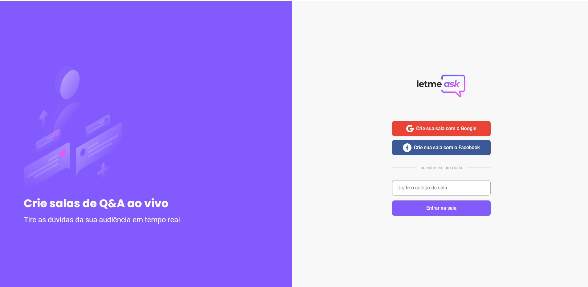

  

    

## #NLW-Together
 Este projeto fez parte da semana de aprendizado junto a [Rocketseat](https://rocketseat.com.br/) nos dias 20 a 25 de junho/2021 

  

## 🧪 Tecnologias utilizadas

Para este projeto de fins didáticos, as tecnologias abordadas foram:

- [React](https://reactjs.org)
- [Firebase](https://firebase.google.com/)
- [TypeScript](https://www.typescriptlang.org/)

## 📝 Licença

O código fonte deste projeto é livre sob licença MIT. Maiores informações no arquivo [LICENSE](LICENSE.md).

